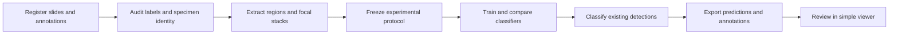

# Smithsonian Fall 2026: initial project pipeline plan

Approved planning scope, September 14, 2026: a **reproducible pollen-classification pipeline and simple results viewer**, with research records suitable for a potential paper. This document is the semester roadmap; its stages are future implementation work, not a claim that a classifier, viewer, or job launcher already exists.

The [project context](PROJECT_CONTEXT.md), [category guide](CATEGORIES.md), [September 11 meeting](../meeting%20transcriptions/2026-09-11_smithsonian_sponsor_meeting_summary.md), and [syllabus](sources/course/DSCI%20435_535%20Fall%202026%20Syllabus.pdf) provide the source context. The user selected pipeline plus simple viewer as the core deliverable and described the initial presentation as a five-minute project-definition presentation. These choices do not establish numeric scientific acceptance targets or replace detailed assignment instructions.

## Current starting point

- The documentation handoff and original source materials are present; the syllabus's repeated upload matches the existing copy exactly.
- NOTS SSH access and reads of example files have succeeded. A training directory contains 82 NDPI images and 82 filename-matched NDPA annotations; the enclosing raw directory contains another 110 NDPI and 46 NDPA entries. These counts are directory observations, not a deduplicated collection census.
- A slide overview and existing HDF5 tile/focal-plane previews have been generated successfully. The [NOTS access and data notes](NOTS_ACCESS.md) record paths, methods, and limitations.
- It remains unverified whether the available Spring 2026 annotations contain Ingrid's Fall 2026 classification updates. Existing tiles and detection outputs have not been approved for new training.
- The PDF supplied as a “rubric” is the syllabus. It explicitly refers to separate detailed grading rubrics, which have not been supplied.

## Pipeline and stage outputs

### Stage A — Register and audit the data

Keep original images on NOTS. In this project, “import” means registering existing file locations and metadata, not uploading the image collection to GitHub.

- Inventory NDPI images, matching NDPA annotations, dimensions, focal planes, file sizes, and source versions. Keep small inventories and configuration in GitHub.
- Establish which annotation set is authoritative for Fall 2026. Compare observed titles and counts with the supplied tables; report differences rather than forcing a match.
- Create stable specimen identifiers linking annotations to their slides, geometry, original titles, and mapped categories.
- Include annotations outside historical training rectangles. Report missing files, unmatched titles, malformed geometry, duplicates, and uncertain labels without silently correcting them. Unannotated regions are not automatically negative examples.
- Start with the 32 YES categories as the intended target set; preserve the 5 MAYBE groups for a separate inclusion assessment. Counts alone do not override workbook classifications.

**Output:** a traceable inventory, category audit, and explicit determination of which labels support classification. Missing or unsuitable Fall 2026 labels block scientific training decisions, not independent infrastructure development.

### Stage B — Build extraction and viewing

- Read selected regions and focal planes without loading complete slides into memory.
- Validate annotation-to-pixel conversion with overlays, including image boundaries and annotations outside old training rectangles. Distinguish annotation geometry from viewer-position metadata.
- Preserve access to specimen focal stacks and derived sharpest-plane and focus-stacked representations. Verify that the chosen reader actually exposes the intended planes.
- Audit existing HDF5 data before reuse: source/version, coordinate conventions, focal-plane ordering, labels, preprocessing, and coverage. Historical rectangle-based tiles may omit new labels.
- Build a simple specimen browser showing slide/specimen identity, original annotation title, mapped category, and focal-plane controls. Keep browsing independent of downloading entire slides to a laptop.

**Output:** verified extraction and an inspection workflow usable by the team and sponsors. A one-off preview is a feasibility demonstration, not completion of this stage.

### Stage C — Freeze the experimental protocol

Write and version the protocol after auditing label quality and class distribution across slides.

- Keep a specimen's focal planes, crops, and augmentations together. Group splits by slide and investigate additional sample relationships that could cause leakage.
- Reserve final test data before model selection; use validation data for tuning. Do not alter evaluation data to improve reported scores.
- Resolve how Ingrid's approximately-60-specimen balancing request interacts with the split. Record selected specimen IDs and random seeds. Aggregate count tables cannot perform specimen selection.
- Evaluate with macro-F1, balanced accuracy, per-class precision/recall, and confusion matrices. Document treatment of non-target classes and uncertain detections.
- Define numeric success targets with the team and sponsors after inspecting labels and establishing a baseline. Record the baseline architecture, split allocation, input construction, sampling policy, and model-selection rule before comparative experiments.

**Output:** a fixed, reviewable protocol. This roadmap deliberately does not invent split ratios, sampling seeds, uncertainty thresholds, model architecture, or accuracy targets before the necessary evidence exists.

### Stage D — Develop and compare classifiers on NOTS

- Establish a reproducible transfer-learning baseline under the frozen protocol.
- Compare sharpest-plane and focus-stacked inputs with the same baseline and split; keep other experimental conditions controlled and record any amendments.
- Evaluate a multifocal approach next if baseline results and error analysis justify it. Record why the comparison is scientifically useful before expanding it.
- Inspect errors by class rarity, staining, preservation, orientation, and slide differences. Preserve examples and limitations alongside summary metrics.
- Obtain and audit prior detection code/weights before reuse. README requests to the supplied Spring 2026 and Fall 2025 GitHub URLs returned 404 for the current account on September 14; this does not prove the repositories do not exist. Local outputs do not establish reproducible code access.

**Output:** evaluated models and an evidence-backed comparison supporting the selected approach. Historical detection AP and inference speed remain distinct from new classification results.

### Stage E — Integrate inference and deliver results

- Accept existing detections as classifier inputs while preserving their model, confidence, and coordinate provenance. Detector outputs are not expert classification ground truth.
- Export prediction tables and new annotation files containing specimen identity, predicted category, and confidence information. Preserve original annotations and validate output compatibility with the intended viewer.
- Extend the simple browser to inspect predictions, filter categories, examine uncertain cases, and export labeled crops.
- Keep GUI fine-tuning and a full whole-slide application as stretch goals; do not let them displace validated classification and usable results.

**Output:** a demonstrated path from a slide's detections to inspectable classification results, with documented limitations and reproducible commands.

## Execution and research records

Training and inference run through Slurm on NOTS compute nodes. A NOTS checkout of the repository opens shared filesystem paths directly; a path in a laptop's configuration does not itself provide remote access. SSH submits/monitors work. GitHub holds code, environment specifications, configuration, small inventories, and reports. See [Rice's NOTS guide](https://kb.rice.edu/147970).

- Read original data from the existing persistent allocation. Do not move, overwrite, or repurpose it.
- Place derived datasets, checkpoints, predictions, logs, and viewer caches under `/projects/dsci435/Smithsonian_F26/`, with separate run directories and team-accessible permissions. This directory had not been created when access was inspected; creating it belongs to the later infrastructure stage.
- For every experiment, record code commit, environment, data/annotation versions, split, configuration, random seed, checkpoint, scheduler job ID, metrics, errors, and compute usage. Record usage for provenance, not as an invented compute budget. Respect the cluster's actual scheduling rules and allocations.
- Preserve failed-run evidence. Diagnose numerical failures, disclose justified protocol amendments, and do not weaken criteria merely to obtain a passing result.
- Keep credentials outside GitHub and use individual team accounts. Avoid changing shared historical environments; specify an isolated, reproducible project environment during implementation.
- Keep experiment comparisons, methods notes, figures, and limitations suitable for developing a paper. Publication and novelty claims remain future decisions, not semester acceptance requirements.

## Semester milestones and grading alignment

The assigned class day is unknown. Both dates below come from the supplied syllabus; use the earlier as an internal target until assignment is known. General syllabus submission times are 3:55 PM for presentations and 11:59 PM for reports/software checks on the assigned day. Consult actual assignment instructions for final applicability; the syllabus says its schedule may change.

| Milestone | Planned evidence |
| --- | --- |
| Initial presentation/report — September 28/30 | Five-minute project definition: scientific question, data, pipeline diagram, known risks, and next steps. This plan does not require a trained model at that milestone. Submit initial self/peer evaluations as assigned. |
| Instructor software review — October 19/21 | Registration, tested extraction, preview browser, environment setup, and a reproducible smoke run |
| Midterm presentation/report — October 26/28 | Baseline results, input-representation comparison, error analysis, updated risks, and midterm self/peer evaluations |
| Midterm software — November 2/4 | Reproducible training/evaluation workflow and documented commands |
| Final presentation — November 30/December 2 | Selected model, evaluation evidence, pipeline/viewer demonstration, and limitations |
| Showcase — week of December 7 | Accessible scientific story, visual examples, and demonstration materials |
| Final submissions — December 13 | Technical report, software release, reproducibility instructions, and final self/peer evaluations |

The syllabus's grading overview maps to the following evidence; these are planning responses to the grading categories, not invented detailed rubric criteria.

| Grading component | Weight | Evidence to maintain |
| --- | ---: | --- |
| Interim evaluations | 15% | Milestone reports/presentations, feedback, and documented responses |
| Final report | 25% | Scientific question, data/protocol, methods, results, limitations, and traceable figures |
| Final presentation | 15% | Clear explanation, defensible claims, and an understandable demonstration |
| Final software | 15% | Documented installation, reproducible runs, meaningful checks, usable outputs, and viewer |
| Self and peer evaluations | 10% | Dated contributions and collaborative work supporting evaluations |
| Individual project contributions | 10% | Reviewed technical, research, writing, and presentation contributions |
| Class participation and oral examination | 10% | Participation and each student's understanding of the project and their work |

These components total 100% (team 70%, individual 30%); the syllabus separately lists a possible 5% Socratic-circle participation bonus. Maintain weekly mentor/team meeting notes, experiment ownership, reviewed changes, and report/presentation contributions. Assign responsibilities through the team; the draft Intro Presentation deck is not a finalized semester assignment list. Students remain responsible for understanding and reviewing their work under the syllabus's AI-use expectations.

## Acceptance checks

| Subsystem | Required evidence at the relevant stage |
| --- | --- |
| Data | Every selected specimen has a resolvable source, stable identity, and traceable label; discrepancies are visible |
| Extraction | Overlays verify geometry and focal-plane handling, including boundary and outside-rectangle examples |
| Evaluation | No prohibited split overlap; validation drives model selection; final test results remain separate |
| Execution | A fresh checkout reproduces a small NOTS run using documented configuration and environment |
| Inference/viewer | Results retain source coordinates and IDs; exports open correctly; browsing does not require full-slide downloads |
| Reporting | Tables, figures, and conclusions trace to recorded runs; prior detection findings are separated from new results |

## Decision log

Status on September 14, 2026. Record each resolution with its date, evidence, and decision-maker; retain the prior entry's historical meaning.

| Decision | Status | Evidence or next resolution |
| --- | --- | --- |
| Core deliverable | Selected by user | Evaluated pipeline plus simple viewer; GUI fine-tuning/full whole-slide app are stretch goals |
| Initial presentation emphasis | Selected by user | Five-minute project-definition presentation; model development is not a prerequisite in this plan |
| Paper preparation | Selected by user | Preserve important methods/results/provenance; publication remains optional |
| Class day | Unassigned | Keep both dates; use earlier dates internally until course assignment |
| Detailed rubric | Missing | Syllabus is preserved, including repeat receipt; obtain separate assignment/rubric document when available |
| NOTS access | Verified for pb52 | SSH and sample reads succeeded; verify each teammate's access separately |
| Authoritative Fall 2026 annotations | Unresolved | Confirm current files/version with sponsors and audit labels, coverage, and table reconciliation |
| MAYBE categories | Unresolved | Evaluate inclusion separately; preserve all supplied priority labels |
| Experimental protocol | Unresolved | Freeze specimen grouping, split, balancing/seed, baseline, and selection rules after Stage A |
| Numeric sponsor acceptance targets | Unresolved | Define after label audit and baseline; do not invent an accuracy threshold |
| Prior code/weights | Access incomplete | Local artifacts found; two supplied repository README requests returned 404 for this account |
| Annotation export contract | Unresolved | Verify format, coordinate preservation, and intended viewer compatibility before final integration |

The unresolved items do not block this roadmap. They limit the later implementation or scientific decisions identified in each stage.
