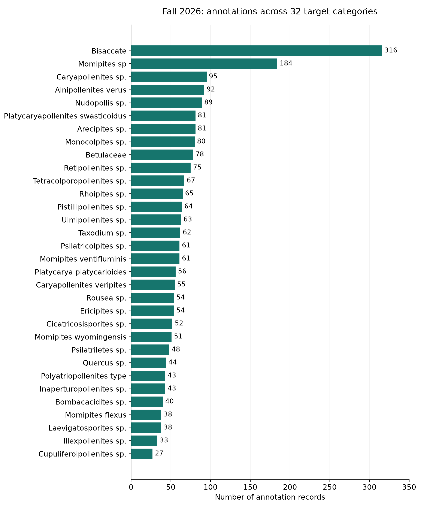

# Initial report: introduction, background, and data

Draft sections for insertion into the team’s existing report. Citation numbering can be merged with the report bibliography.

## 1. Introduction and objectives

Fossil pollen provides evidence of the plants that grew in ancient environments. Smithsonian researchers are studying specimens from across North America dating to approximately 50–60 million years ago to better understand vegetation during past warm climates. Their digitized collections contain large numbers of microscopic specimens, making manual identification a substantial task. The project aims to support this work by helping researchers identify pollen categories in microscope images while retaining the ability to inspect and correct model outputs. [1]

Finding a specimen and identifying its category are separate tasks. Detection locates an object in an image; classification assigns it a biological category. Previous Rice D2K work developed a palynomorph detection pipeline. Our semester’s emphasis is to extend this foundation toward biologically useful classification, supported by a reproducible workflow and a simple results viewer. [2, 3]

The project’s main objective is to assign biologically useful categories to fossil pollen specimens while preserving their locations in the original images. Supporting objectives are to establish a reliable image-and-label inventory, assess identification performance across categories, and make predictions available for expert inspection. The intended outcome is a tool that assists researchers in reviewing large collections; it does not replace expert identification or directly reconstruct past climate.

## 2. Background and related work

The supplied preprint by Shaikh and colleagues addresses scalable detection of fossil palynomorphs in multifocal microscopy images. Its pipeline combines image tiling, focal-plane compression, object detection, and aggregation of predictions across tiles. The paper describes 82 annotated slides selected from a larger collection of 847 slides. Those historical counts describe its detection study, not the verified 83 image/annotation pairs in our current Fall inventory. This work offers a practical starting point for reading large images and locating specimens, while our task adds the challenge of assigning useful categories. [3]

Detection Transformer (DETR) frames object detection as prediction of a set of objects and uses a transformer architecture with matching between predictions and annotated objects. It provides background for the proposed Roboflow Detection Transformer (RF-DETR) approach. We will use a recorded implementation and checkpoint version rather than assuming that different detector releases are interchangeable. [4, 5]

Swin Transformer builds hierarchical image representations using attention within shifted local windows. We propose evaluating its smaller Swin-Tiny variant as a classifier for cropped specimens. Its architectural design motivates testing it on visual morphology, but does not establish that it will outperform alternatives on fossil pollen. That is an experimental question. [6]

Our contribution is an applied comparison and reproducible integration of existing methods for this collection. We do not claim a new transformer architecture or established methodological novelty. The central question is whether these methods can distinguish the sponsor’s categories despite unequal example counts and variation in focus, staining, preservation, and slide preparation.

## 3. Data and initial exploration

The current inventory contains 83 microscope image files paired with the correct Fall annotation files. Images use the NanoZoomer Digital Pathology Image (NDPI) format and contain multiple focal planes. Separate NanoZoomer Digital Pathology Annotation (NDPA) files store annotation titles and geometry. Multiple focal depths matter because different structures may be sharp in different planes. Whole-slide images are large, so processing will use selected image regions rather than loading an entire slide into memory. [3, 7]

The sponsor supplied two complementary tables. The title-count table maps original annotation names to categories and gives their frequencies. The category-total workbook gives category counts and YES, MAYBE, or NO classifications indicating training priorities. Category names are sponsor-defined groups and should not all be described as individual species. [2]

**Table 1. Composition of the verified Fall annotation inventory. Counts are annotation records before specimen-quality review, duplicate checking, or sampling.**

| Sponsor designation | Categories | Named annotations | Planned treatment |
| --- | ---: | ---: | --- |
| YES | 32 | 2,290 | Starting inventory for the classification task |
| MAYBE | 5 | 114 | Separate inclusion assessment |
| NO | 28 | 8,871 | Outside the initial target-category inventory |
| Total | 65 | 11,275 | Complete named inventory |

An additional 227 untitled marks are excluded from the named totals. They include 133 rectangles and 94 circles. Across the named inventory, all 185 annotation-title counts and all 65 category totals match the sponsor tables. Three annotation labels required trimming trailing whitespace; no inferred biological aliases were required. The earlier mismatch arose from an older or incomplete annotation set. Original titles and source files remain preserved. [7]

Class representation is uneven. Bisaccate has 316 annotations across 42 slides, while Cupuliferoipollenites sp. has 27 across nine slides. Retipollenites sp. has 75 annotations but occurs on only three slides, illustrating why count alone does not measure diversity. The sponsors’ priority categories Arecipites sp., Bombacacidites sp., and Platycarya platycarioides contain 81, 40, and 56 annotations, respectively. These patterns motivate reporting category-level performance and checking how specimens are distributed across slides. [7]

**Figure 1. Annotation counts for all 32 YES categories in the corrected Fall inventory. The unequal counts motivate an explicit training-sampling policy and evaluation that gives each category appropriate attention. These are source counts, not final training-set sizes.**

All 83 corresponding images passed header and small center-region read checks, and the paired annotation files on the cluster matched the supplied Fall files by checksum. These checks establish access and source consistency, not complete image integrity or suitability of every specimen crop. [7]

## References for these sections

[1] Romero, I. C. *Identification of fossil pollen*. Sponsor presentation supplied to the team, September 2026. Local source: `docs/sources/presentations/Rice presentation project.pdf`.

[2] Romero, I. C. Sponsor email and category tables, September 14, 2026; sponsor meeting transcript, September 18, 2026. Local sources: `docs/sources/correspondence/2026-09-14_ingrid_romero_email.md`, `docs/sources/data/`, and `meeting transcriptions/`.

[3] Shaikh, A., et al. *Scalable Detection of Fossil Palynomorphs in Multifocal Digital Microscopy Images*. Supplied preprint. Background discussion here draws on the abstract and Sections 1–3; publication status is not inferred from the filename. Local source: `docs/sources/references/WACV_manuscript_for_Smithsonian_preprint.pdf`.

[4] Carion, N., et al. (2020). *End-to-End Object Detection with Transformers*. https://arxiv.org/abs/2005.12872

[5] Roboflow. *RF-DETR*, official software repository. https://github.com/roboflow/rf-detr (accessed September 27, 2026).

[6] Liu, Z., et al. (2021). *Swin Transformer: Hierarchical Vision Transformer using Shifted Windows*. https://arxiv.org/abs/2103.14030

[7] Smithsonian Fall 2026 team. Corrected annotation inventory and source verification, September 21–25, 2026. Local evidence: `data/current/category_summary.csv`, `title_reconciliation.csv`, `audit_manifest.json`, `cluster_verification.json`, and `presentations/data_update_2026-09-25/sponsor_table_verification.json`.
